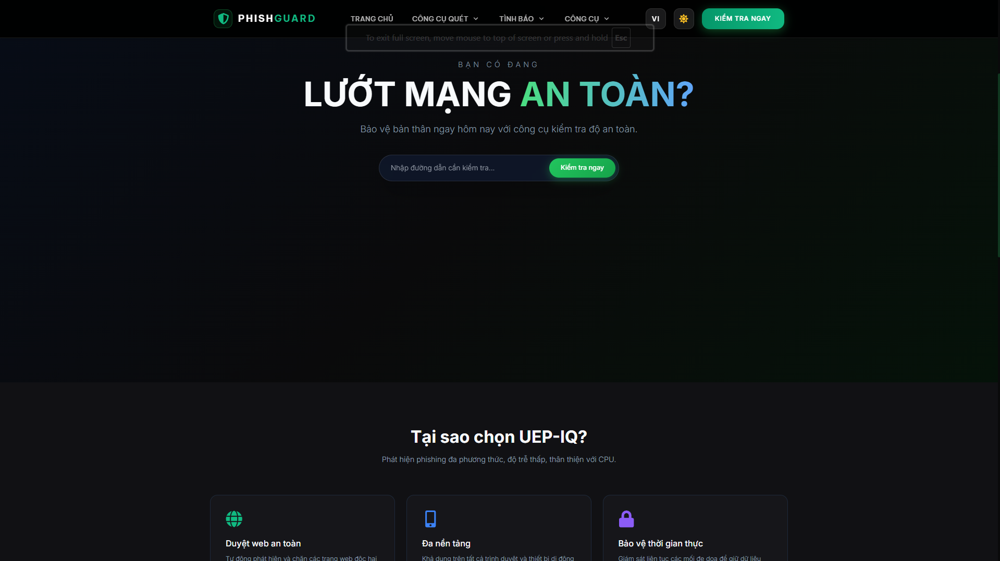
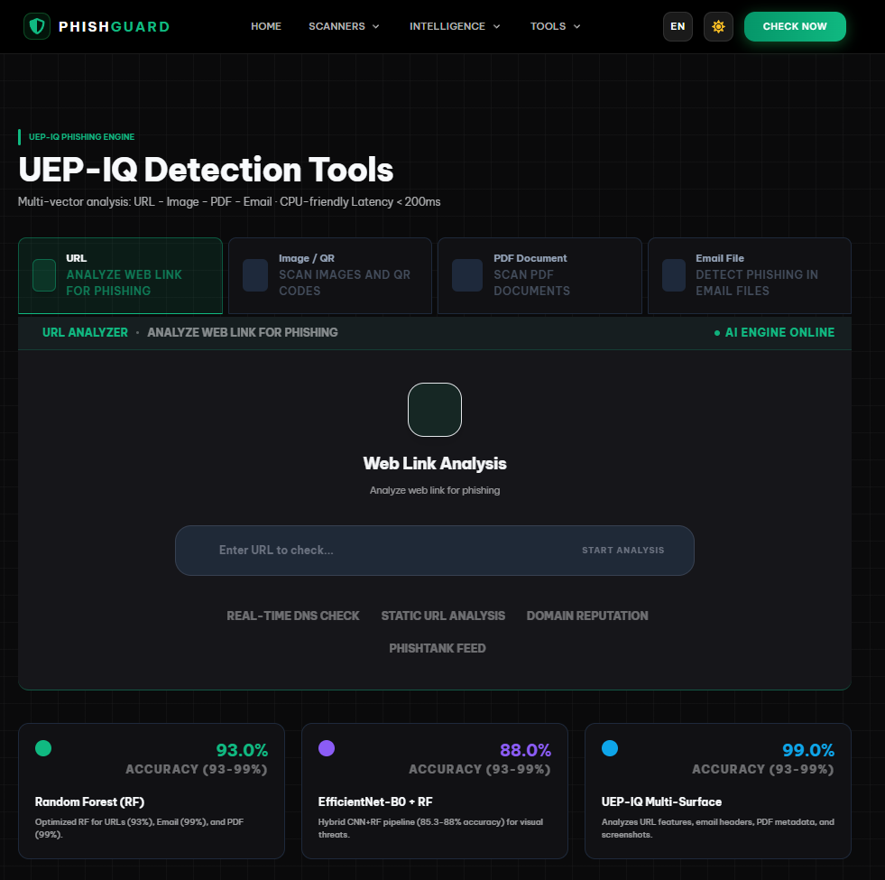
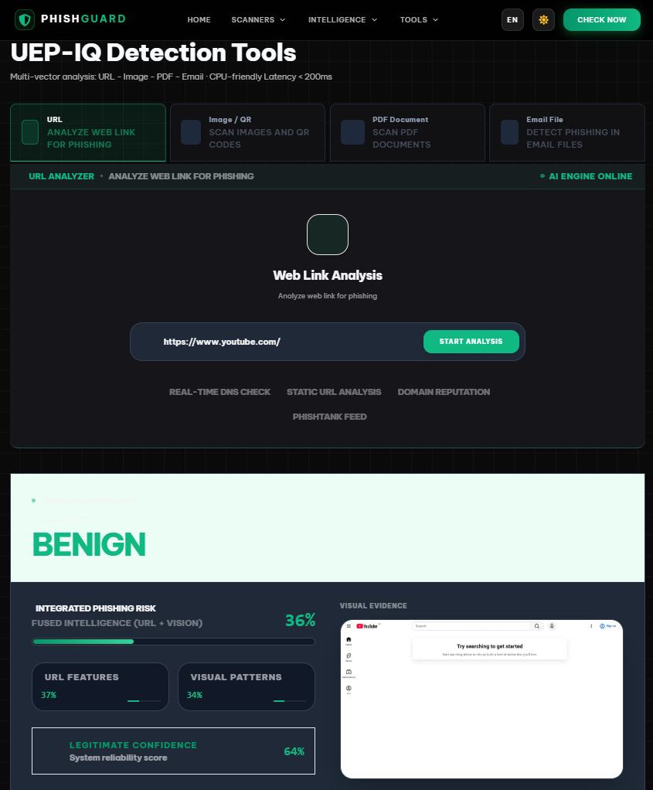
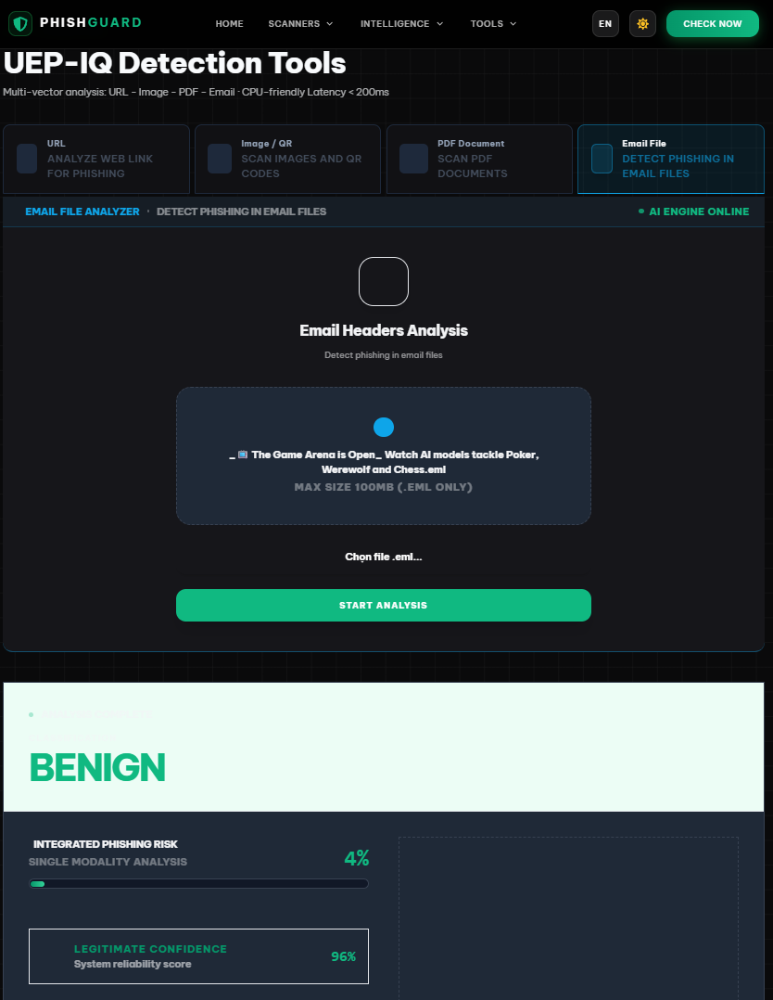
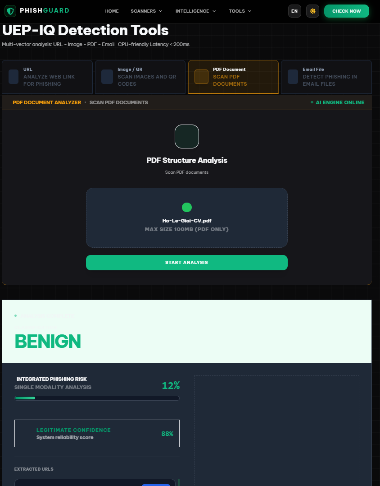
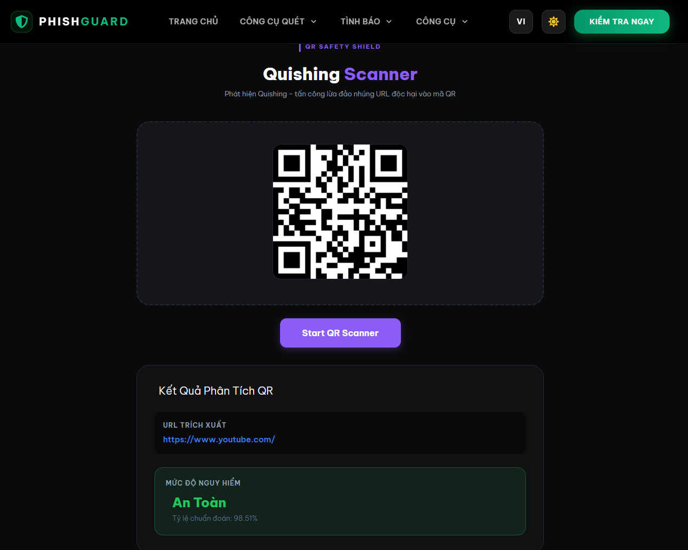
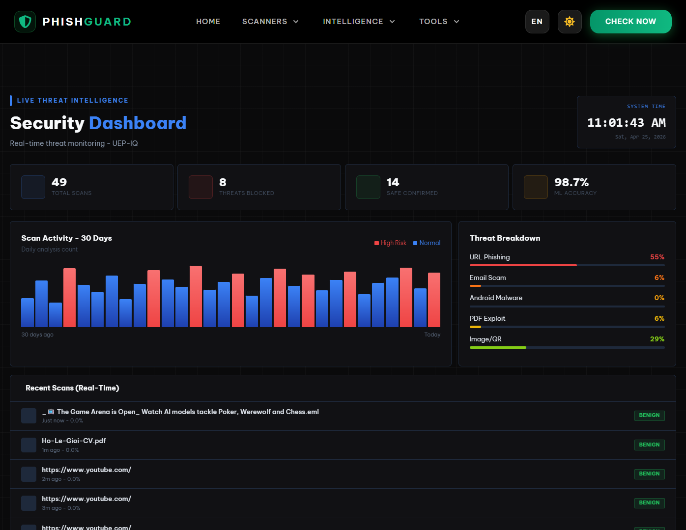
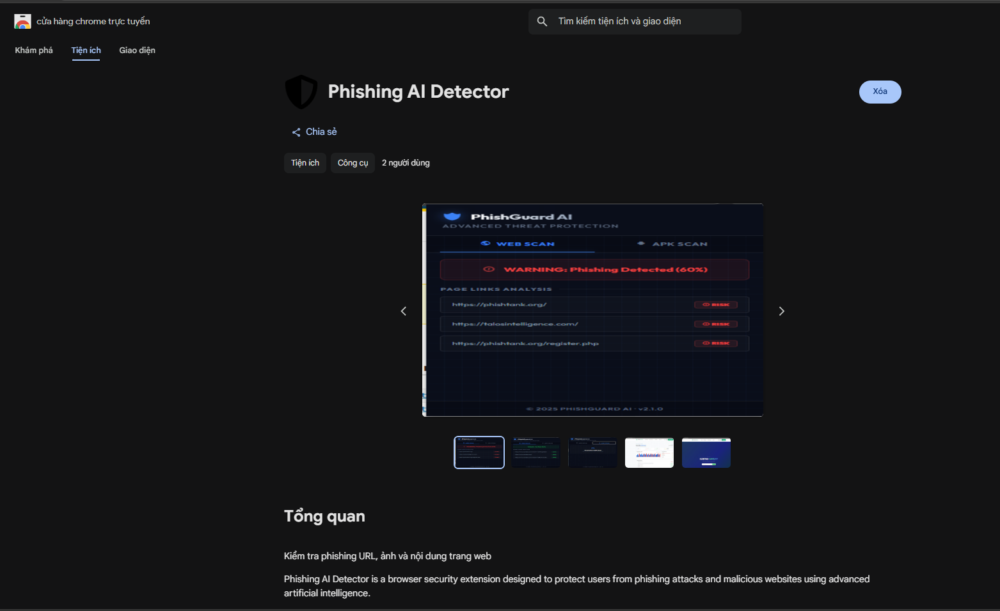

<div align="center">

# UEP-IQ: A Deployable Multi-Modal Phishing Detection Framework

[](https://www.python.org/)
[](https://flask.palletsprojects.com/)
[](https://www.tensorflow.org/)
[](https://scikit-learn.org/)
[](https://chromewebstore.google.com/detail/phishing-ai-detector/paaapfmmpeheagonmpkciecfdhkophem)
[](https://phd.infoseclab.id.vn/)
[](./ICCIES_2026___Phishing__Camera_Ready_.pdf)
[](./LICENSE)

**Accepted at ICCIES 2026** — Posts and Telecommunications Institute of Technology (PTIT), Vietnam

[Live Demo](https://phd.infoseclab.id.vn/) · [Chrome Extension](https://chromewebstore.google.com/detail/phishing-ai-detector/paaapfmmpeheagonmpkciecfdhkophem) · [Paper (PDF)](./ICCIES_2026___Phishing__Camera_Ready_.pdf)

</div>

---

## Overview

Modern phishing campaigns no longer rely on a single attack vector. Adversaries simultaneously exploit **malicious URLs**, **spoofed email headers**, **weaponized PDF documents**, and **image/QR-code lures** — rendering single-modality detectors brittle in real-world deployments.

**UEP-IQ** (*Unified Engine for Phishing — URL, Image/QR*) is a unified, deployable multi-modal phishing detection framework that addresses this gap by integrating:

- **Lightweight Random Forest (RF) classifiers** for structured artifacts: URL lexical/structural features, email header anomalies, and PDF metadata descriptors.
- **A hybrid vision module** using EfficientNet-B0 as a frozen feature extractor with an RF head for phishing screenshots and QR-code misuse detection.
- **A modality-agnostic aggregation layer** with both heuristic-weighted and learned (stacking) fusion strategies.
- **Sub-200 ms end-to-end latency** on CPU-only infrastructure, validated through a production web application and a published Chrome browser extension.

> *"A production-oriented hybrid architecture can provide scalable, accurate, and practical defense against contemporary multi-surface phishing campaigns."* — ICCIES 2026

---

## Live Demo & Screenshots

### Homepage — PhishGuard Platform



### URL Phishing Scanner

> Real-time Web Link Analysis with Static URL Analysis, DNS Check, Domain Reputation, and PhishTank feed integration.



### URL Analysis Result — `https://www.youtube.com/` → **BENIGN** (64% confidence)



### Email Header Analyzer (.EML)

> RFC-compliant header parsing: From/Reply-To alignment, Received chain anomalies, X-Spam headers, and temporal inconsistencies.



### PDF Malware Scanner

> Metadata analysis: file size, embedded objects, JavaScript presence, action descriptors from CIC-Evasive-PDFMal2022 features.



### Image / QR Code Phishing Scanner

> EfficientNet-B0 frozen backbone + RF head. QR codes are decoded and forwarded to the URL pipeline (cross-modal linkage).



### Threat Intelligence Dashboard

> Real-time scan history, per-modality threat breakdown, and community-reported phishing intelligence.



### Published Chrome Extension

[](https://chromewebstore.google.com/detail/phishing-ai-detector/paaapfmmpeheagonmpkciecfdhkophem)

---

## System Architecture

UEP-IQ is organized into six main components supporting end-to-end phishing detection:

```
┌─────────────────────────────────────────────────────────────┐
│            Multi-Modal Ingestion Layer                      │
│   (Web Application / Browser Extension)                     │
│   Input: URL · EML Email · PDF · Image/QR                   │
└───────────────────────┬─────────────────────────────────────┘
                        │  Route by modality
        ┌───────────────┼──────────────────────┐
        ▼               ▼                      ▼
  ┌──────────┐   ┌─────────────┐      ┌──────────────────┐
  │ URL      │   │ Email / PDF │      │  Image / QR      │
  │ Feature  │   │ Feature     │      │  Preprocessing   │
  │ Extractor│   │ Extractor   │      │  (resize+norm)   │
  └────┬─────┘   └──────┬──────┘      └────────┬─────────┘
       │                │                       │
       ▼                ▼                       ▼
  ┌──────────────────────────┐     ┌────────────────────────┐
  │  RF Inference Service    │     │  CNN Inference Service │
  │  (URL · Email · PDF RF)  │     │  EfficientNet-B0       │
  │                          │     │  (frozen) + RF head    │
  └───────────┬──────────────┘     └──────────┬─────────────┘
              │                               │
              └──────────────┬────────────────┘
                             ▼
              ┌──────────────────────────────┐
              │   Aggregation & Decision     │
              │   Layer                      │
              │   ─ Heuristic-weighted fusion│
              │   ─ Learned stacking fusion  │
              │   Output: L_i ∈ [0,1], ŷ_i  │
              └──────────────┬───────────────┘
                             ▼
              ┌──────────────────────────────┐
              │   RESTful API / Browser      │
              │   Extension Integration      │
              │   < 200 ms end-to-end        │
              └──────────────────────────────┘
```

**QR → URL Cross-Modal Linkage:** When a QR code is detected in an image, the decoded URL is forwarded to the URL preprocessing pipeline, enabling cross-modal signal fusion between visual and textual components.

---

## Key Features

| Feature | Description |
|---|---|
| **URL Phishing Detection** | 19+ lexical/structural features extracted from canonicalized URLs; Gini-importance feature selection; RF classifier |
| **Email Header Analysis** | RFC-compliant EML parsing; From/Reply-To/Return-Path alignment; Received chain anomaly detection; X-Spam headers |
| **PDF Malware Detection** | CIC-Evasive-PDFMal2022 feature schema; embedded script/action flags; page count and object statistics |
| **Image / QR Detection** | EfficientNet-B0 frozen backbone + RF head; data augmentation; QR decode → URL linkage |
| **Multi-Modal Fusion** | Heuristic-weighted aggregation + learned logistic stacking meta-classifier |
| **Real-Time Inference** | < 200 ms end-to-end on CPU; 6–8 ms for URL; 65–95 ms for images |
| **Web Application** | React frontend + Flask backend; file upload (EML/PDF/image); real-time results |
| **Browser Extension** | Published on Chrome Web Store; inline URL interception and classification |

---

## Model Details

### Structured Modalities — Random Forest (URL, Email, PDF)

RF classifiers are chosen for their robustness to heterogeneous metadata, resistance to noisy inputs, and interpretability through feature importance (Gini impurity). Per-modality hyperparameters are tuned independently with bootstrapped sampling and balanced class weights.

**URL feature vector** `v_url` includes:
- URL/domain length, digit count, special character count
- Subdomain depth, `@` symbol presence, IP-based domain flag
- HTTPS scheme indicator, query parameter count and diversity

**Email feature groups** `[f_struct, f_align, f_recv, f_spam]`:
- Structural completeness (From, To, Sender, Reply-To, Return-Path)
- Domain alignment between envelope sender and From
- Received-chain routing anomalies and timestamp gaps
- X-Spam-Status, X-Mailer, X-Priority, Message-ID formatting

**PDF features** `v_pdf`:
- File size, page count, embedded object count
- JavaScript presence flag, action descriptor flag
- Stream-level statistics

All three pipelines apply **Gini-importance feature selection**, reducing overfitting on high-dimensional representations. Ablation shows this pruning step yields +2.5 pp on URL accuracy (93% vs 90.5%).

### Visual Modality — EfficientNet-B0 + RF Head

1. Input images resized to **128 × 128**, normalized to [0, 1]
2. Training augmentation: random rotations, shifts, zoom, horizontal flip
3. **EfficientNet-B0** pretrained on ImageNet used as **frozen backbone**
4. Global Average Pooling (GAP) + dense projection → compact embeddings
5. **RF classifier** on embeddings (avoids overfitting on limited phishing image data)
6. QR codes decoded → URL forwarded to URL pipeline (cross-modal linkage)

### Aggregation Layer

**Single-modality:** `L_i = p_i^(m)`, thresholded at τ = 0.5

**Multi-modal heuristic fusion:**

$$L_i = \frac{\sum_{m \in \mathcal{M}_i} w_m \cdot p_i^{(m)}}{\sum_{m \in \mathcal{M}_i} w_m}$$

**Learned stacking fusion** (best overall):

$$L_i = \sigma\!\left(b + \sum_{m \in \mathcal{M}_i} \alpha_m \cdot \text{logit}(p_i^{(m)})\right)$$

A logistic meta-classifier trained on validation log-odds scores, naturally handling missing modalities.

---

## Performance

### Per-Modality Accuracy vs. Baselines

| Modality | Proposed Model | Accuracy (Proposed) | Best Baseline | Accuracy (Baseline) |
|---|---|---|---|---|
| URL | Random Forest | **93.0%** | SVM (RBF) | 90.2% |
| Email | Random Forest | **99.0%** | MLP | 96.1% |
| PDF | Random Forest | **99.0%** | SVM | 94.5% |
| Image / QR | EfficientNet-B0 + RF | **85.3–88.0%** | ResNet-18 | 81.2% |

### Ablation: Feature Selection Impact

| Model Variant | URL Acc. (%) | Email Acc. (%) | PDF Acc. (%) |
|---|---|---|---|
| Full RF model (with Gini selection) | **93.0** | **99.0** | **99.0** |
| RF without feature selection | 90.5 | 98.6 | 98.7 |

### Ablation: Image Pipeline

| Model | Accuracy (%) | Val. Accuracy (%) |
|---|---|---|
| CNN head (Dense classifier) | 81.2 | 78.4 |
| EfficientNet-B0 + RF (w/o augmentation) | 83.4 | 80.1 |
| **EfficientNet-B0 + RF (with augmentation)** | **88.0** | **85.4** |

### Multi-Modal Fusion Comparison

| Fusion Strategy | Accuracy (%) | AUC (%) |
|---|---|---|
| Max fusion | 94.4 | 97.2 |
| Mean fusion | 95.2 | 97.8 |
| Heuristic-weighted | 96.0 | 98.3 |
| **Learned stacking** | **96.6** | **98.7** |

### Inference Latency (CPU Backend)

| Modality | Latency | Notes |
|---|---|---|
| URL (RF) | 6–8 ms | Suitable for browser-level blocking |
| Email (RF) | 12–18 ms | Dominated by header parsing |
| PDF (RF) | 20–35 ms | Depends on metadata extraction |
| Image (EfficientNet-B0 + RF) | 65–95 ms | Vision backbone dominates |
| **Web upload + inference (E2E)** | **120–180 ms** | Below 200 ms threshold |
| **Browser extension inline check** | **80–110 ms** | Below 200 ms threshold |

---

## Dataset Sources

| Modality | Dataset | Description |
|---|---|---|
| URL | [PhishTank](https://phishtank.org) | Verified phishing URLs, community-reported |
| URL | [OpenPhish](https://github.com/openphish/publicfeed) | Live phishing feed |
| URL | [UCI PhiUSIIL](https://archive.ics.uci.edu/dataset/967/phiusiil+phishing+url+dataset) | Kaggle/UCI phishing URL features |
| URL | [Majestic Million](https://downloads.majestic.com/majesticmillion.csv) | Top-1M benign domains baseline |
| Email | [Nazario Phishing Corpus](http://www.monkey.org/~jose/phishing/) | Real phishing EML samples |
| Email | [Apache SpamAssassin](https://spamassassin.apache.org/old/publiccorpus/) | Ham/spam email corpus |
| PDF | [CIC-Evasive-PDFMal2022](https://www.unb.ca/cic/datasets/pdfmal2022.html) | Malicious and benign PDF metadata |
| Image | CIRCL Images Phishing Dataset | Phishing webpage screenshots |

All datasets are cleaned, deduplicated, and harmonized (80% train / 20% test split per modality).

---

## Installation

### Prerequisites

- Python 3.12+
- Node.js 18+ and npm
- Git

### Quick Start

```bash
# 1. Clone the repository
git clone https://github.com/Yairoo04/PhishingAI_Detection_System.git
cd PhishingAI_Detection_System

# 2. Create and activate a virtual environment
python -m venv venv
# Windows:
venv\Scripts\activate
# macOS/Linux:
source venv/bin/activate

# 3. Install Python dependencies
pip install -r requirements.txt

# 4. Copy and configure environment variables
cp .env.example .env
# Edit .env with your API keys / paths as needed

# 5. Start the Flask backend (serves frontend build at localhost:5001)
cd backend
python app.py
```

The application will be accessible at `http://localhost:5001`.

### Frontend Development (Optional)

```bash
cd frontend
npm install
npm start        # Dev server at http://localhost:3000
npm run build    # Production build → frontend/build/
```

> **Note:** The Flask backend serves the pre-built React SPA from `frontend/build/`. For development, run both servers concurrently.

---

## Usage

### Web Application

Navigate to `http://localhost:5001` (or the live demo at [phd.infoseclab.id.vn](https://phd.infoseclab.id.vn/)):

| Feature | How to Use |
|---|---|
| **URL Check** | Enter any URL in the homepage scanner or go to Scanners → URL. Click *Start Analysis* for phishing probability and classification. |
| **Email Upload** | Go to Scanners → Email File. Drag-and-drop or select an `.eml` file. The system parses RFC headers and returns a phishing likelihood score. |
| **PDF Upload** | Go to Scanners → PDF Document. Upload a `.pdf` file. Metadata is extracted and classified by the RF model. |
| **Image / QR** | Go to Scanners → Image/QR. Upload a screenshot or QR image. QR codes are decoded and also analyzed as URLs. |
| **Dashboard** | Go to Intelligence → Threat Dashboard for real-time scan history, modality breakdown, and community reports. |

### Browser Extension

1. Install from the [Chrome Web Store](https://chromewebstore.google.com/detail/phishing-ai-detector/paaapfmmpeheagonmpkciecfdhkophem)
2. The extension automatically intercepts URLs on visited pages
3. Click the extension icon to see the phishing probability for the current page
4. URLs are forwarded to the backend API for real-time classification (80–110 ms)

---

## API Reference

The backend exposes RESTful endpoints under `/api/`. All requests over HTTPS. Max file size: 10 MB.

### URL Detection

```http
POST /api/url/predict
Content-Type: application/json

{ "url": "https://example.com" }
```

**Response:**
```json
{
  "prediction": "Phishing",
  "probability": 0.8958,
  "label": 1
}
```

### File Upload (Email / PDF / Image)

```http
POST /api/email/predict        # for .eml files
POST /api/file/predict         # for .pdf files
POST /api/image/predict        # for image/QR files
Content-Type: multipart/form-data

file=<binary>
```

**Response:**
```json
{
  "prediction": "Phishing",
  "probability": 0.67,
  "modality": "email"
}
```

### Dashboard & Intelligence

```http
GET /api/dashboard/stats        # Threat statistics
GET /api/domain/lookup          # Domain reputation
GET /api/community/reports      # Community threat reports
GET /api/darkweb/check          # Dark web exposure check
```

---

## Project Structure

```
PhishingAI_Detection_System/
├── backend/                    # Flask backend
│   ├── app.py                  # Application entry point, blueprint registration
│   ├── routes/                 # API route blueprints
│   │   ├── url.py              # URL phishing detection endpoint
│   │   ├── email.py            # Email (.eml) analysis endpoint
│   │   ├── file.py             # PDF analysis endpoint
│   │   ├── image.py            # Image/QR detection endpoint
│   │   ├── dashboard.py        # Threat intelligence dashboard
│   │   ├── domain.py           # Domain reputation lookup
│   │   ├── community.py        # Community threat reports
│   │   ├── darkweb.py          # Dark web exposure check
│   │   └── android.py          # Android APK analysis endpoint
│   ├── services/               # Business logic and ML inference
│   ├── utils/                  # Feature extractors and preprocessors
│   └── data/                   # Runtime data and scan history
├── frontend/                   # React SPA
│   ├── src/
│   │   ├── pages/              # Home, PhishingTools, MalwareTools
│   │   ├── components/         # Reusable UI components
│   │   ├── styles/             # CSS and styling
│   │   └── i18n/               # Internationalization (EN/VI)
│   └── build/                  # Production build (served by Flask)
├── models/                     # Trained model weights
│   ├── random_forest_URL.pkl   # RF model for URL detection
│   ├── random_forest_email.pkl # RF model for email header analysis
│   ├── random_forest_file.pkl  # RF model for PDF detection
│   └── cnn_phishing_image.keras# EfficientNet-B0 + RF image model
├── PhishingDetector/           # Chrome extension source
├── docs/
│   └── images/                 # Screenshots for documentation
├── dataset_Email/              # Email dataset (gitignored if large)
├── dataset_File/               # PDF dataset (gitignored if large)
├── dataset_Image/              # Image dataset (gitignored if large)
├── ICCIES.tex                  # Conference paper LaTeX source
├── ICCIES_2026___Phishing__Camera_Ready_.pdf
├── requirements.txt            # Python dependencies
├── .env.example                # Environment variable template
└── README.md
```

---

## Case Studies (from Paper)

| Artifact | Input | Score | Verdict |
|---|---|---|---|
| URL | `https://citadlbaking.com` | 89.58% | **Phishing** |
| Email | `_email_1504.eml` | 67% | **Phishing** |
| Email | `Key insights from the 2024 Stack Overflow Developer Survey.eml` | 5% | Legitimate |
| Image | `phishing_90.png` | 94.38% | **Phishing** |
| Image | `Facebook_Screenshot.png` | 32.07% | Legitimate |
| PDF | `test2.pdf` | 78% | **Phishing** |
| PDF | `ttnt_01.pdf` | 33% | Legitimate |

---

## Future Work

- **Transformer-based semantic encoders** (BERT/DistilRoBERTa) for email body and webpage text analysis where compute budgets permit
- **Adversarial robustness** — training against evasive artifacts (obfuscated URLs, adversarial images, encrypted PDFs)
- **Dataset diversity** — expanding coverage across languages, regions, and emerging phishing vectors (smishing, vishing, QR phishing)
- **Explainability** — SHAP/LIME integration for per-prediction feature attribution
- **Enterprise deployment** — integration with network gateways, SIEM systems, and mobile environments
- **LLM-driven fusion** — exploring multimodal LLM-based aggregation as a learned fusion alternative

---

## Authors

**Trong-Thua Huynh** [](https://orcid.org/0000-0003-3934-1067), Hy Phan Thanh, Gioi Ho Le, Tri Nguyen Dinh Quoc, Tien Tran Phuc, Kien Nguyen Trung

*Posts and Telecommunications Institute of Technology (PTIT), Ho Chi Minh City, Vietnam*

Contact: [thuaht@ptit.edu.vn](mailto:thuaht@ptit.edu.vn)

---

## Citation

If you use UEP-IQ in your research, please cite:

```bibtex
@inproceedings{huynh2026uepiq,
  title     = {{UEP-IQ}: A Deployable Multi-Modal Phishing Detection Framework},
  author    = {Huynh, Trong-Thua and Phan Thanh, Hy and Ho Le, Gioi and
               Nguyen Dinh Quoc, Tri and Tran Phuc, Tien and Nguyen Trung, Kien},
  booktitle = {Proceedings of the International Conference on Computing,
               Information and Engineering Sciences (ICCIES 2026)},
  year      = {2026},
  institution = {Posts and Telecommunications Institute of Technology, Vietnam}
}
```

---

## Acknowledgements

This research is supported by the **Posts and Telecommunications Institute of Technology (PTIT)**, Vietnam.

---

## License

This project is licensed under the MIT License. See [LICENSE](./LICENSE) for details.

---

<div align="center">

**[Live Demo](https://phd.infoseclab.id.vn/) · [Chrome Extension](https://chromewebstore.google.com/detail/phishing-ai-detector/paaapfmmpeheagonmpkciecfdhkophem) · [Paper](./ICCIES_2026___Phishing__Camera_Ready_.pdf)**

*Made at PTIT Vietnam*

</div>
